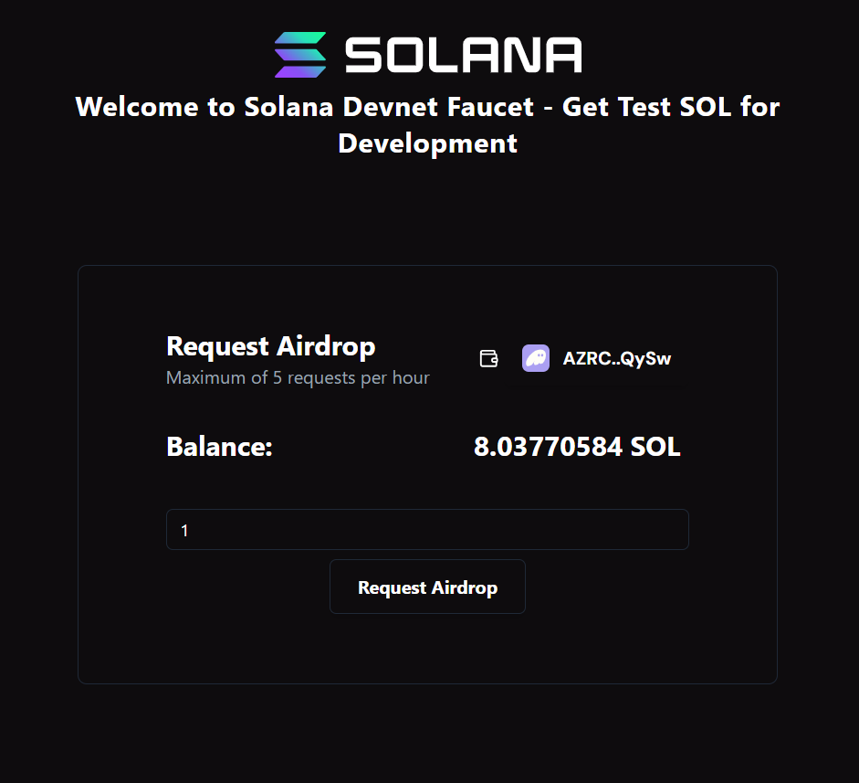

# Solana Airdrop Faucet

This repository provides a simple Solana Airdrop Faucet for testing on the Solana devnet. The faucet allows users to request a small amount of SOL (Solana cryptocurrency) to their wallets. The faucet utilizes the `@solana/web3.js` library for interacting with the Solana blockchain and is built using React.

  <!-- Adjust the path according to your image location -->

## Features

- Request SOL (Airdrop) to your wallet address
- Connect with any Solana wallet adapter (e.g., Phantom, Sollet)
- Built for Solana's devnet
- React and TypeScript frontend
- Easy-to-use and customizable faucet

## Live Demo

You can try out the Solana Airdrop Faucet live at:  
[https://solana-airdrop-faucet-mbs2p0g4t-abhilov-projects.vercel.app/](https://solana-airdrop-faucet-mbs2p0g4t-abhilov-projects.vercel.app/)

## Prerequisites

Before using this faucet, ensure you have:

1. A Solana wallet connected (e.g., Phantom or Sollet).
2. Node.js and npm/yarn installed.

## Installation

To get started, clone the repository and install the dependencies:

```bash
git clone https://github.com/abhilov23/Solana_airdrop_faucet.git
cd Solana_airdrop_faucet
npm install
# or if using yarn
# yarn install
